### 注意点
1. $data
    > 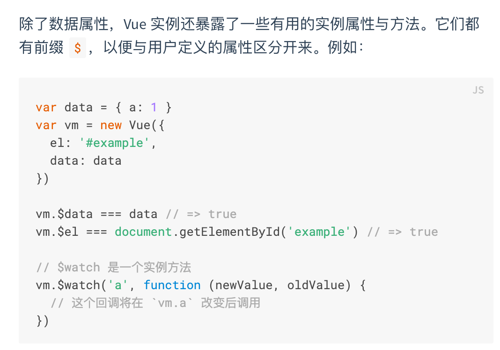

2. [生命钩子](https://cn.vuejs.org/v2/guide/instance.html#%E7%94%9F%E5%91%BD%E5%91%A8%E6%9C%9F%E5%9B%BE%E7%A4%BA)
   > 你只要知道 mounted created method computed咋用就行了
   > 我反正没用到其他的
   > -- by 业哥

   > 在 Vue 中，computed 的属性可以被视为是 data 一样，可以读取和设值，因此在 computed 中可以分成 getter（读取） 和 setter（设值），一般情况下是没有 setter 的，computed 预设只有 getter ，也就是只能读取，不能改变设值。
   > vue.js计算属性默认只有 getter，因为是默认值所以我们也常常省略不写
   > https://www.jianshu.com/p/56f337688d6b

   > computed属性 vs. method属性：
   > 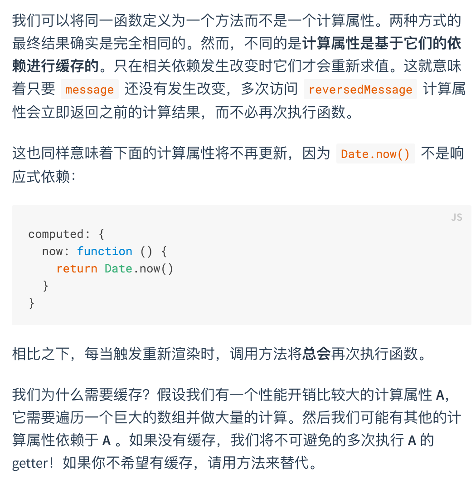

   > computed属性 vs. watch属性：
   > 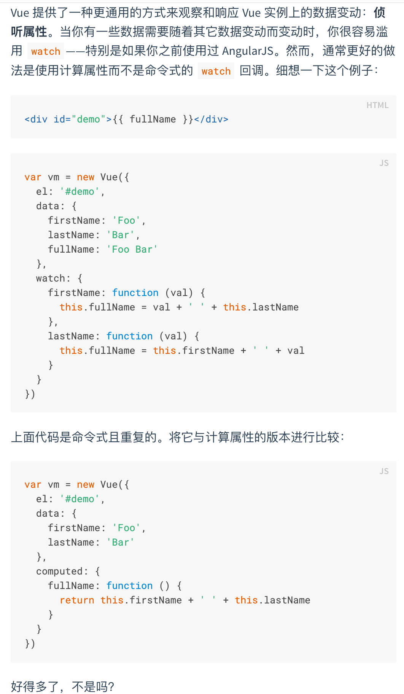
   
   > 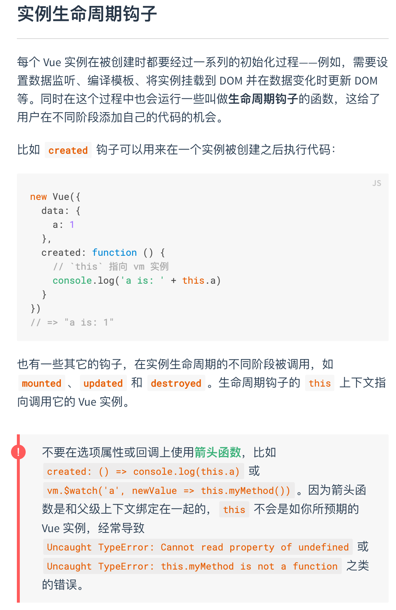
   > 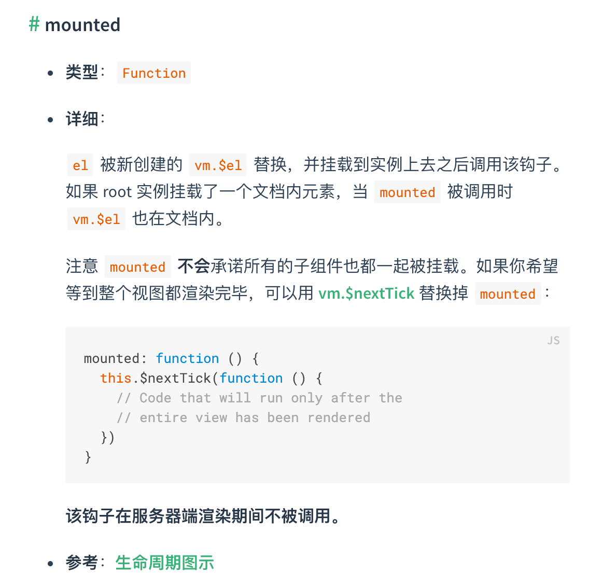

3. 指令简写
   > 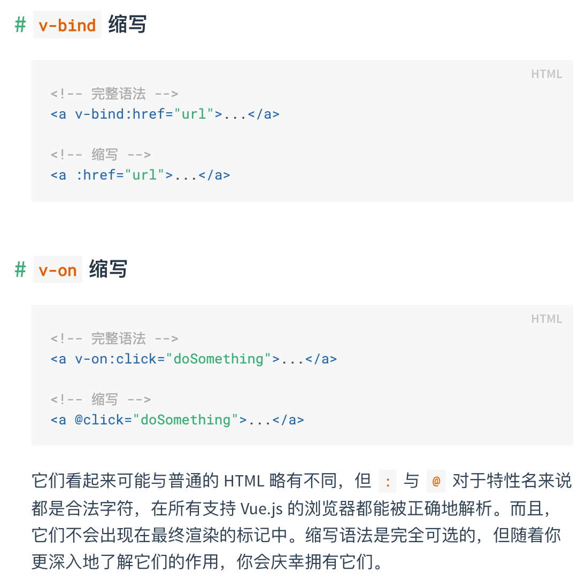

4. 绑定 HTML Class
    > 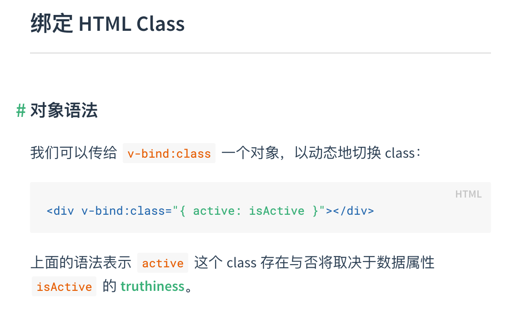

5. 表单绑定
    > 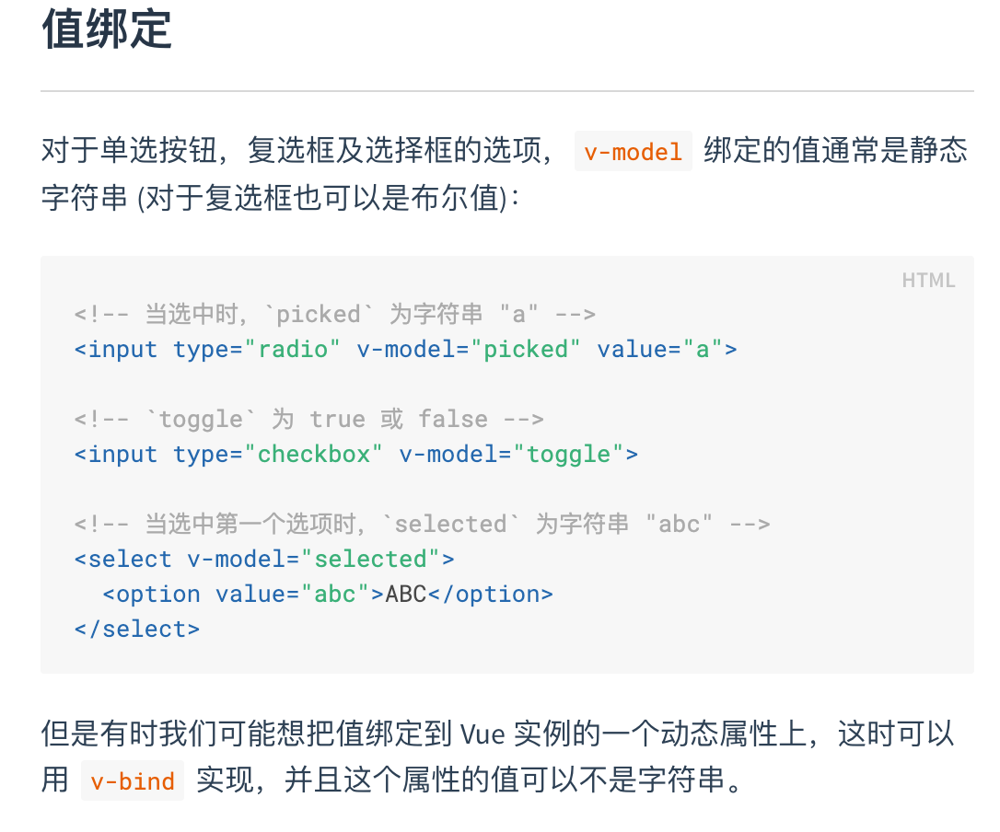
    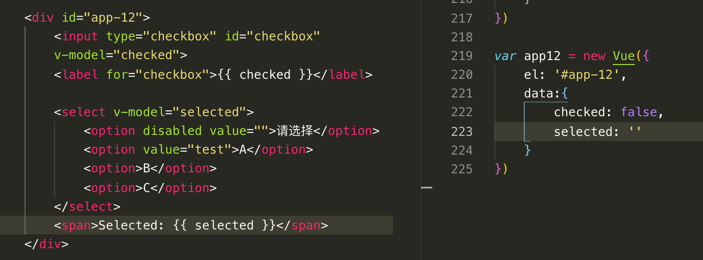
    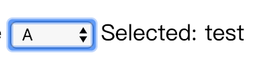
    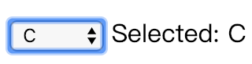

6. 事件修饰符
    > 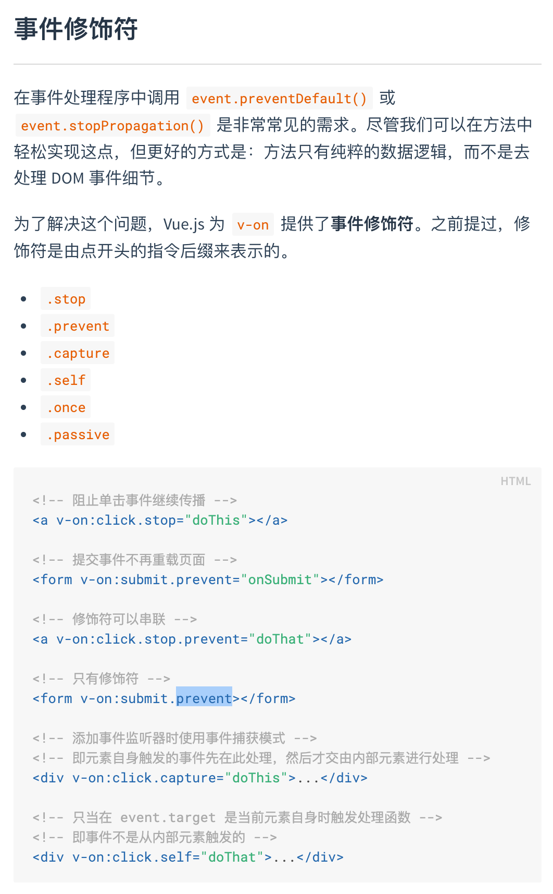

7. 通过事件向父级组件发送消息 - 使用事件抛出一个值
    ```
    <div id="blog-posts-events-demo">
        <!-- 下面这个div是<blog-post>的父级组件 -->
         <div :style="{ fontSize: postFontSize + 'em' }">
             <blog-post
             v-for="post in posts"
             v-bind:key="post.id"
             v-bind:post="post"
             v-on:enlarge-text="postFontSize += $event"></blog-post>
         </div>
    </div>
    ```
    > 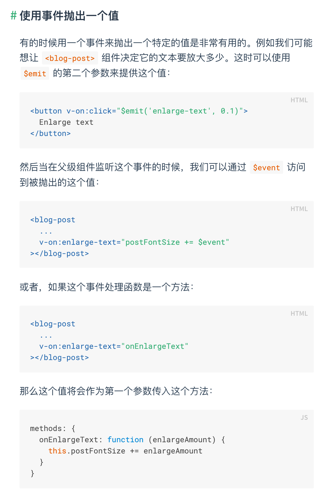

8. 在组件上使用v-model
    > 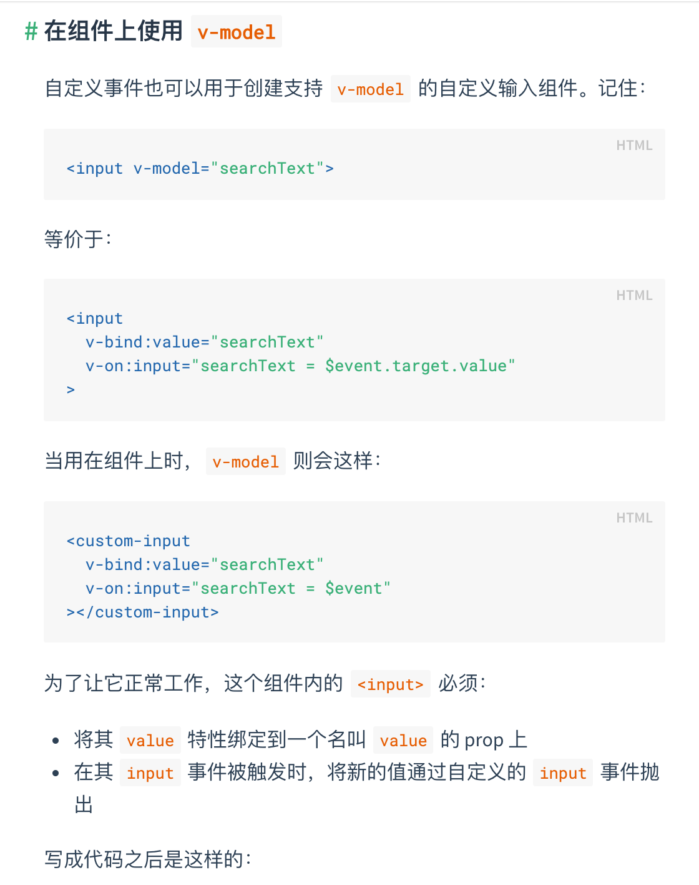
    > 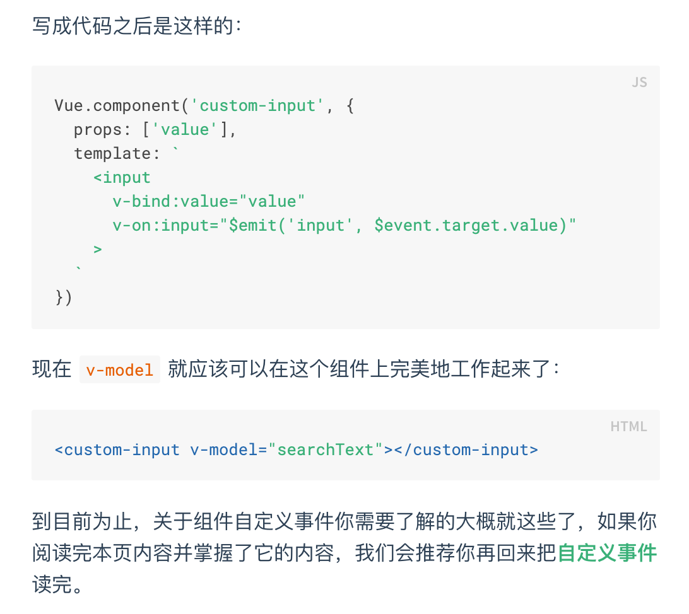